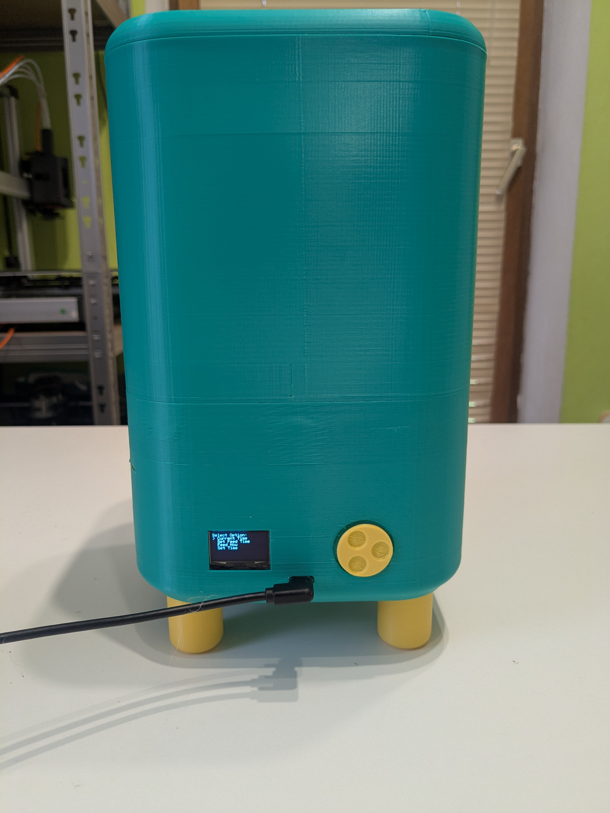
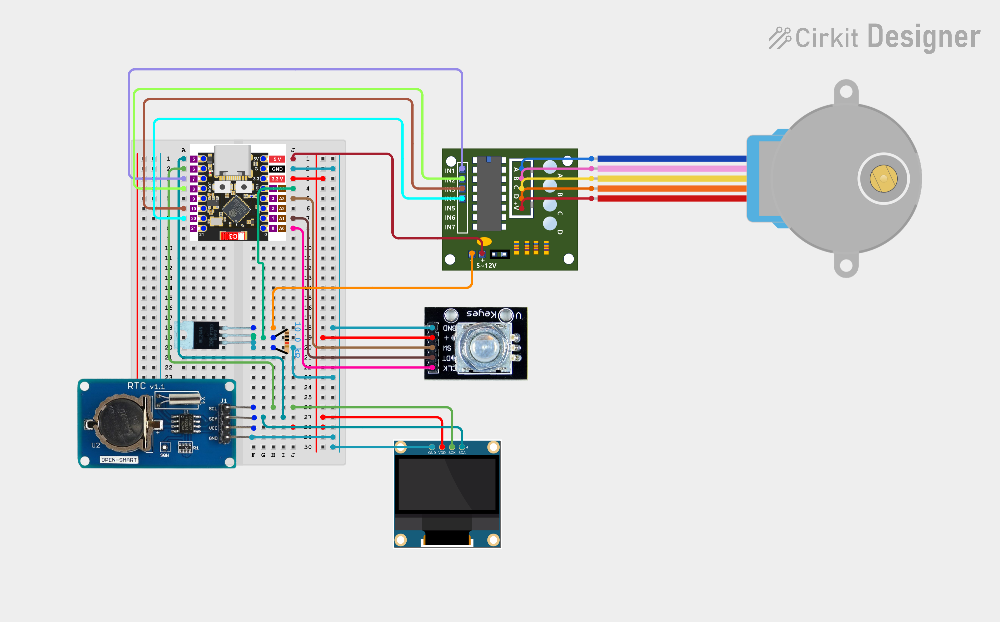
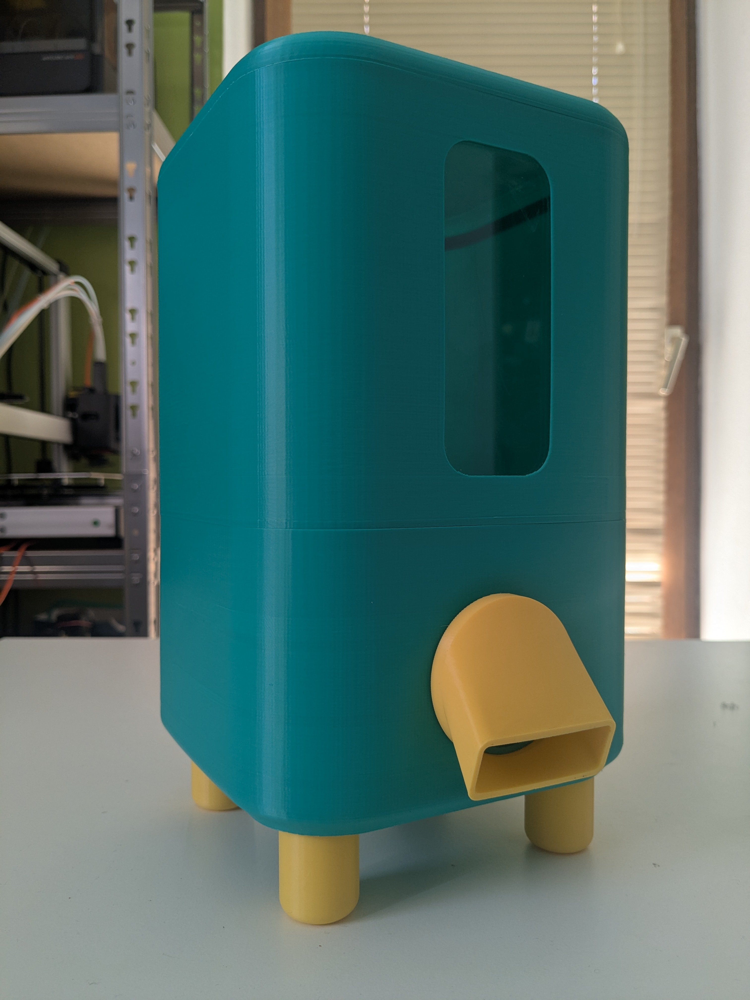
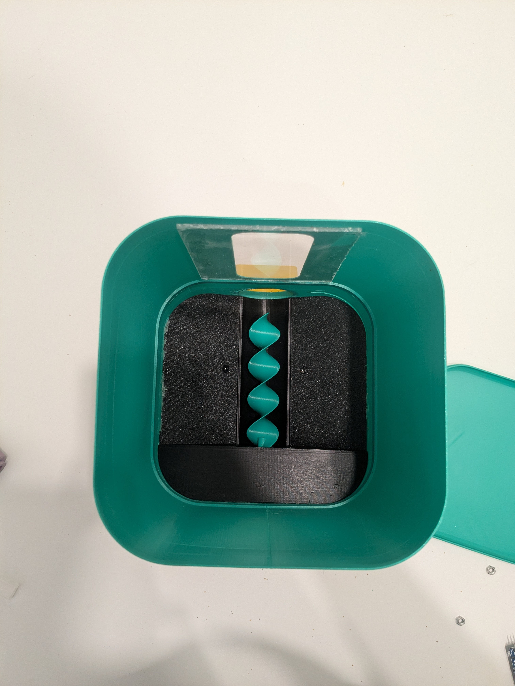
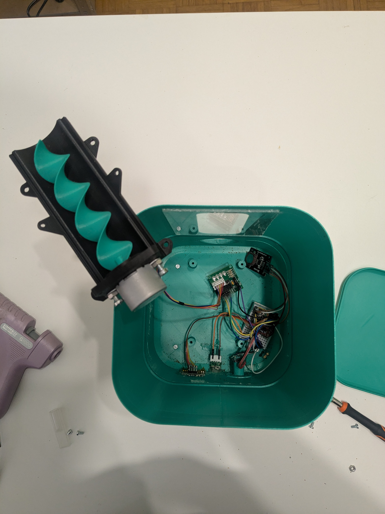
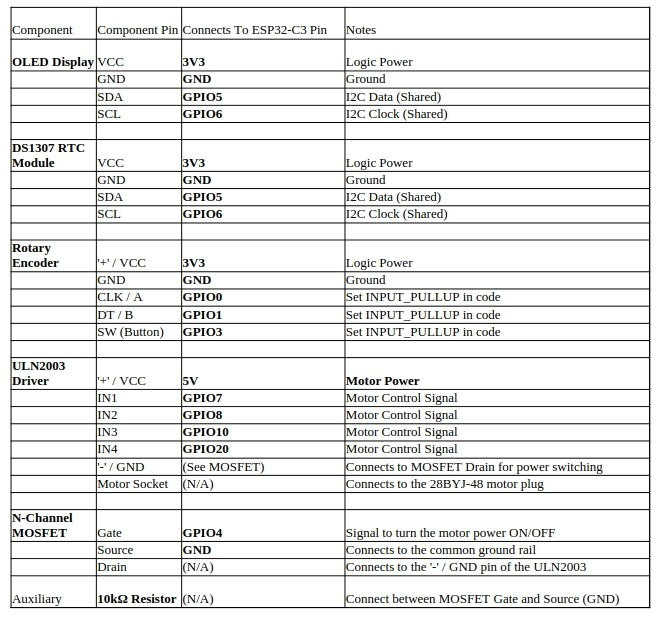

# Catfeeder with Persistent Memory

This project is a 3D-printed cat feeder that uses an Arduino Nano, a stepper motor, and a DRV8825 driver to dispense food. The feeder's settings are stored in the Arduino's EEPROM, so they persist even after the power is turned off.

## Features

* **3D-printed parts:** All parts of the feeder are designed to be 3D-printed.
* **Persistent memory:** The feeder's settings are stored in the Arduino's EEPROM, so they don't have to be reset every time the power is turned off.
* **Simple to build and use:** The feeder is designed to be easy to build and use, even for people with no prior experience with electronics or programming.

## Pictures

## STLs

The STLs for the 3D-printed parts are located in the `STLs` directory.

## Code

The Arduino code for the feeder is located in the `catfeederPersistentMem.ino` file.
